# Table of Contents

- [Simple Storage Service (S3)](#simple-storage-service--s3-)
  - [Introduction to S3](#introduction-to-s3)
    - [Object Storage](#object-storage)
    - [S3 Object](#s3-object)
    - [S3 Bucket](#s3-bucket)
  - [S3 - Storage Classes](#s3---storage-classes)
    - [Standard (default)](#standard--default-)
    - [Intelligent Tiering](#intelligent-tiering)
    - [Standard Infrequently Accessed (IA)](#standard-infrequently-accessed--ia-)
    - [One Zone IA](#one-zone-ia)
    - [Glacier](#glacier)
    - [Glacier Deep Archive](#glacier-deep-archive)
  - [S3 - Storage Classes Comparison](#s3---storage-classes-comparison)
  - [S3 - Security](#s3---security)
  - [S3 - Encryption](#s3---encryption)
    - [Encryption In Transit](#encryption-in-transit)
    - [Server Side Encryption (SSE) - Encryption At Rest](#server-side-encryption--sse----encryption-at-rest)
    - [Client-Side Encryption](#client-side-encryption)
  - [S3 - Data Consistency](#s3---data-consistency)
    - [New Objects (PUTS)](#new-objects--puts-)
    - [Overwrite (PUTS) or Delete Objects (DELETES)](#overwrite--puts--or-delete-objects--deletes-)
  - [S3 - Cross Region Replication (CRR )](#s3---cross-region-replication--crr--)
  - [S3 - Versioning](#s3---versioning)
  - [S3 - Lifecycle Management](#s3---lifecycle-management)
  - [S3 - Transfer Acceleration](#s3---transfer-acceleration)
  - [S3 - Presigned URLs](#s3---presigned-urls)
  - [S3 - MFA Delete](#s3---mfa-delete)
  - [S3 - Cheat Sheet](#s3---cheat-sheet)
- [Snowball](#snowball)
  - [Introduction to Snowball](#introduction-to-snowball)
    - [Snowball features and limitations](#snowball-features-and-limitations)
  - [Snowball Edge](#snowball-edge)
    - [Snowball features and limitations](#snowball-features-and-limitations-1)
  - [Snowmobile](#snowmobile)
    - [Security Features](#security-features)
  - [Snowball - Cheat Sheet](#snowball---cheat-sheet)
- [Virtual Private Cloud](#virtual-private-cloud)
  - [Core Components](#core-components)
  - [VPC Key Features](#vpc-key-features)
  - [Default VPC](#default-vpc)
  - [Default Everywhere IP](#default-everywhere-ip)
  - [VPC Peering](#vpc-peering)
  - [VPC Route Tables](#vpc-route-tables)
  - [VPC Internet Gateway (IGW)](#vpc-internet-gateway--igw-)
  - [VPC Bastion / Jumpbox](#vpc-bastion---jumpbox)
  - [VPC Direct Connect](#vpc-direct-connect)
  - [VPC Endpoints Introduction](#vpc-endpoints-introduction)
  - [VPC Interface Endpoints](#vpc-interface-endpoints)
  - [VPC Gateway Endpoints](#vpc-gateway-endpoints)
  - [VPC Flow Logs Introduction](#vpc-flow-logs-introduction)
  - [VPC Network Access Control List Introduction](#vpc-network-access-control-list-introduction)
  - [VPC NACLs Use Case](#vpc-nacls-use-case)
  - [VPC Security Groups Introduction](#vpc-security-groups-introduction)
  - [VPC Security Groups Limits](#vpc-security-groups-limits)
  - [VPC Security Groups Use Case](#vpc-security-groups-use-case)
  - [VPC Network Address Translation (NAT)](#vpc-network-address-translation--nat-)
  - [VPC NAT Instances VS NAT Gateways](#vpc-nat-instances-vs-nat-gateways)
  - [VPC Cheat Sheet](#vpc-cheat-sheet)
    - [Endpoint Cheat Sheet](#endpoint-cheat-sheet)
    - [Flow Logs Cheat Sheet](#flow-logs-cheat-sheet)
    - [NACLs Cheat Sheet](#nacls-cheat-sheet)
    - [Security Group Cheat Sheet](#security-group-cheat-sheet)
    - [NAT Instance and NAT Gateway Cheat Sheet](#nat-instance-and-nat-gateway-cheat-sheet)
- [Identity Access Management (IAM)](#identity-access-management--iam-)
  - [IAM Core Component](#iam-core-component)
    - [IAM Identities](#iam-identities)
    - [IAM Policies](#iam-policies)
    - [Use case](#use-case)
  - [IAM Types of Policies](#iam-types-of-policies)
  - [IAM Policies Structure](#iam-policies-structure)
  - [IAM Password Policy](#iam-password-policy)
  - [IAM Programmatic Access Keys](#iam-programmatic-access-keys)
  - [IAM Multi-Factor Authentication](#iam-multi-factor-authentication)
  - [IAM Cheat Sheet](#iam-cheat-sheet)
- [Amazon Cognito](#amazon-cognito)
  - [Amazon Cognito Introduction](#amazon-cognito-introduction)
  - [Amazon Cognito Web Identity Federation](#amazon-cognito-web-identity-federation)
    - [Web Identity Federation](#web-identity-federation)
    - [Identity Provider (IdP)](#identity-provider--idp-)
    - [Types of Identity Providers](#types-of-identity-providers)
  - [Amazon Cognito User Pools](#amazon-cognito-user-pools)
    - [User Pools Feature](#user-pools-feature)
    - [User Pools Settings](#user-pools-settings)
  - [Amazon Cognito Identity Pools](#amazon-cognito-identity-pools)
  - [Amazon Cognito Sync](#amazon-cognito-sync)
  - [Amazon Cognito Cheat Sheet](#amazon-cognito-cheat-sheet)
- [AWS CLI & SDK](#aws-cli---sdk)
  - [AWS Command Line Interface (CLI)](#aws-command-line-interface--cli-)
  - [AWS Software Development Kit (SDK)](#aws-software-development-kit--sdk-)
  - [AWS Programmatic Access - Access Key and Secret](#aws-programmatic-access---access-key-and-secret)

---

# Simple Storage Service (S3)

## Introduction to S3

- Object-based storage service
- Serverless storage in the cloud

### Object Storage

data storage architecture that manages data as objects, as opposed to other storage architectures:

- **file system** which manages data as a file and fire hierarchy
- **block storage** which manages data as blocks within sectors and tracks

S3 provides you with **unlimited storage**. You don't need to think about the underlying infrastructure.

The S3 console provides an interface for you to upload and access your data.

### S3 Object

Object contains your data. They are like files.

Object may consist of:

- **Key**: this is the name of the object
- **Value**: the data itself made up of a sequence of bytes
- **Version ID**: when versioning enabled, the version of object
- **Metadata**: additional information attached to the object

You can store data from **_0 Bytes_** to 5 Terabytes in size

### S3 Bucket

Buckets hold objects. Buckets can also have folders which in turn hold objects.

S3 is a universal namespace so bucket names must be unique (just like a domain name).

## S3 - Storage Classes

Trade **Retrieval Time**, **Accessibility** and **Durability** for **Cheaper Storage**.

From top to bottom is the most expensive to the cheapest.

### Standard (default)

Fast! 99.99% Availability, 11 9's Durability. Replicated across at least three AZs.

### Intelligent Tiering

Uses ML to analyze your object usage and determine and appropriate storage class. Data is moved to the most cost-effective access tier, without any performance impact or added overhead.

### Standard Infrequently Accessed (IA)

Still fast! Cheaper if you access files less than once a month. Additional retrieval fee is applied. 50% less than Standard (reduced availability)

### One Zone IA

Still fast! Objects only exist in one AZ. Availability is 99.5%, but cheaper than Standard IA by 20% less because of reduce durability. Data could get destroyed. A retrieval fee is applied.

### Glacier

For long-term cold storage. Retrieval of data can take minutes to hours but the off is very cheap storage.

### Glacier Deep Archive

The lowest cost storage class. Data retrieval time is 12 hours.

## S3 - Storage Classes Comparison

S3 Guarantees:

- Platform is built for 99.99% availability
- Amazon guarantee 99.9% availability
- Amazon guarantees 11' 9s of durability

|                                  | Standard | Intelligent Tiering | Standard IA | One-zone IA |    Glacier    | Glacier Deep Archive |
| :------------------------------: | :------: | :-----------------: | :---------: | :---------: | :-----------: | :------------------: |
|            Durability            |  11 9's  |       11 9's        |   11 9's    |   11 9's    |    11 9's     |        11 9's        |
|           Availability           |  99.99%  |        99.9%        |    99.9%    |    99.5%    |      N/A      |         N/A          |
|         Availability SLA         |  99.99%  |         99%         |     99%     |     99%     |      N/A      |         N/A          |
|               AZs                |    >3    |         >3          |     >3      |      1      |      >3       |          >3          |
| Min Capacity charger per storage |   N/A    |         N/A         |    128kb    |    128kb    |     40kb      |         40kb         |
|   Min storage duration charge    |   N/A    |       30 days       |   30 days   |   30 days   |    90 days    |       180 days       |
|          Retrieval fee           |   N/A    |         N/A         |   Per GB    |   Per GB    |    Per GB     |        Per GB        |
|        First byte latency        |    ms    |         ms          |     ms      |     ms      | mins to hours |        hours         |

## S3 - Security

All new buckets are PRIVATE when created by default.

Access control is configured using **Bucket Policies** and **Access Control Lists (ACL)**:

- **Access Control Lists**: Legacy feature of controlling access to buckets and objects.
- **Bucket Policies**: Use a policy to define complex rule access.

## S3 - Encryption

### Encryption In Transit

Traffic between your local host and S3 is achieved via **SSL/TLS**.

### Server Side Encryption (SSE) - Encryption At Rest

Amazon help you encrypt the object data.

S3 Managed Key (Amazon manages all the keys):

- **SSE-AES**: S3 handles the key, uses AES-256 algorithm
- **SSE-KMS**: Envelope encryption, AWS KMS and you manage the keys
- **SSE-C**: Customer provided key (you manage the keys)

### Client-Side Encryption

You encrypt your own files before uploading them to S3.

## S3 - Data Consistency

### New Objects (PUTS)

**Read After Write Consistency:**

When you upload a new S3 object, you are able read immediately after writing.

### Overwrite (PUTS) or Delete Objects (DELETES)

**Eventual Consistency:**

When you overwrite or delete an object it takes time for S3 to replicate version to AZs.

If you were to read immediately, S3 may return you an old copy. You need to generally wait a few seconds before reading.

## S3 - Cross Region Replication (CRR )

When enabled, any object that is uploaded will be **automatically replicated** to another region(s), provides higher durability and potential disaster recovery for object.

You must have **versioning** turned on both the **source** and **destination** buckets. You can have cross-region replication replicate to another AWS account.

## S3 - Versioning

Versioning will:

- Store all versions of an object in S3
- Once enabled, it can NOT be disabled, only suspended on the bucket
- Fully integrated with S3 Lifecycle rules
- MFA Delete feature provides extra protection against deletion of your data

## S3 - Lifecycle Management

Lifecycle Management can:

- Automate the process of moving objects to different Storage classes or deleting objects all together.
- Be used together with **versioning**.
- Be applied to **current** and **previous** version.

Use-case:

1. Set to move object to Glacier after 7 days
2. Set to permanently delete after 365 days

## S3 - Transfer Acceleration

Fast and secure transfer of files **over long distances** between your end users and an S3 bucket.

Utilize **CloudFront**'s distributed **Edge Locations**.

Instead of uploading to your bucket, users use a **_distinct URL_** for an Edge Location.

As data arrives at the Edge Location, it will automatically routed to S3 over a specially optimized network plan (Amazon's backbone network).

## S3 - Presigned URLs

Generate a URL which provides you temporary access to an object to either upload or download object data. Presigned URLs are commonly used to provide access to **private object**.

You can use AWS CLI or AWS SDK to generate presigned URLs.

A sample presigned URL will look like this:

```
https://mybucket.s3.amazonaws.com/myobject?AWSAccessKeyId=AKJAXXXXXXXXX&Expires=1503608432743&Signature=fdjasfadshf3432%fds
```

It will include:

1. Access Key
2. Expired Timestamp
3. Signature

## S3 - MFA Delete

**MFA Delete** ensures users can not delete objects from a bucket unless they provide their MFA code.

MFA Delete can only be enabled under these conditions:

1. The **AWS CLI** must be used to turn on MFA
2. The bucket must have **versioning turned on**

Only the bucket owner logged in as **Root User** can **DELETE** objects from bucket.

## S3 - Cheat Sheet

- **Simple Storage Service** (S3) Object-based storage. Store **unlimited** amount of data without worry of underlying storage infrastructure
- S3 replicates data across at least 3 AZs to ensure 99.99% availability and 11' 9s of durability
- Objects contain your data (they're like files)
- Objects can be size anywhere from **0 Bytes** up to 5 Terabytes
- Buckets contain objects. Buckets can also contain folders which can in turn can contain objects
- When you upload a file to S3 successfully, you'll receive a HTTP 200 code
- **Lifecycle Management** Objects can be moved between storage classes or objects can be deleted automatically based on a schedule
- **Versioning** Objects are giving a Version ID. When new objects are uploaded the old objects are kept. You can access any object version. When you delete an object the previous object is restored. Once Versioning is turned on, it can not be turn off, only suspended.
- **MFA Delete** enforce DELETE operations to require MFA token in order to delete an object. Must have versioning turned on to use. Can only turn on MFA Delete from the AWS CLI. Root Account is only allowed to delete object
- All new buckets are **private by default**
- Logging can be turned to on a bucket to log to track operations performed on object
- **Access Control** is configured using **Bucket Policies** and **Access Control List (ACL)**
- **Bucket Policies** are JSON documents which let you write complex control access
- **ACLs** are the legacy method (not deprecated) where you grant access to objects and buckets with simple actions.
- **Security in Transit** - Uploading files is done over SSL
- **SSE** stands for Server Side Encryption. S3 has **3 options** for SSE
- **SSE-AES** - S3 handles the key, uses AES-256 algorithm
- **SSE-KMS** - Envelope encryption via AWS KMS and you manage the key
- **SSE-C** - Customer provided key (you manage the keys)
- **Client-Side Encryption** - You must encrypt your own files before uploading them to S3
- **Cross Region Replication (CRR)** allows you to replicate files across regions for greater durability. You must have versioning turned on in the source and destination bucket. You can have CRR replicate to bucket in another AWS account
- **Transfer Acceleration** provide faster and secure uploads from anywhere in the world. Data is uploaded via distinct url to an Edge Location. Data is then transported to your S3 bucket via AWS backbone network
- **Presigned Urls** is a url generated via the AWS CLI and SDK. It provides temporary access to write or download object data. Presigned Urls are commonly used to access private objects.
- S3 has **6 different** Storage Classes:
  - **Standard**: Fast! 99.99% Availability, 11 9's Durability. Replicated across at least three AZs.
  - **Intelligent Tiering**: Use ML to analyze your object usage and determine the appropriate storage class. Data is moved to the most cost-effective access tier, without any performance impact or added overhead.
  - **Standard Infrequently Accessed (IA)**: Still Fast! Cheaper if you access files less than once a month. Additional retrieval fee is applied. 50% less than Standard (reduced availability).
  - **One Zone IA**: Still fast! Objects only exist in one AZ. Availability is 99.5%, but cheaper than Standard IA by 20% less (Reduce durability). Data could get destroyed. A retrieval fee is applied.
  - **Glacier**: For long term cold storage. Retrieval of data can take minutes to hours but the off is very cheap storage.
  - **Glacier Deep Archive**: The lowest cost storage class. Data retrieval time is 12 hours.

# Snowball

## Introduction to Snowball

- **Low Cost**: It cost thousands of dollars to transfer 100 TB over high speed internet. Snowball can reduce that costs by **1/5th**
- **Speed**: It can take 100 TB over 100 days to transfer over high speed internet. Snowball can reduce that transfer time by **less than a week**
- Snowball come in two sizes:
  - **50 TB** (42 TB of usable space)
  - **80 TB** (72 TB of usable space)

### Snowball features and limitations

- E-lnk display (shipping information)
- Tamper and weather proof
- Data is encrypted end-to-end (256-bit encryption)
- Use Trusted Platform Module (TPM): a specialized chip on an endpoint device that stores RSA encryption keys specific to the host system for hardware authentication
- For security purposes, data transfer must be completed within **90 days** of the Snowball being prepared
- Snowball can **Import** and **Export** from S3

## Snowball Edge

Similar to Snowball but with more storage and with local processing

- **Petabyte-scale** data transfer service
- **Move data onto AWS** via physical briefcase computer
- **More storage** and on-site **computer capabilities**
- Snowball Edge come in two sizes:
  - **100 TB** (42 TB of usable space)
  - **100 TB Clustered** (45 TB per node)

### Snowball features and limitations

- LCD display (shipping information and other functionality)
- Can undertake local processing and edge-computing workloads
- Can use in a cluster in groups of 5 to 10 devices
- Three options for device configurations
  - storage optimized (24 vCPUs)
  - compute optimized (54 vCPUs)
  - GPU optimized (54 vCPUs)

## Snowmobile

a 45-foot long ruggedize shipping container, pulled by a semi-trailer truck.

Transfer up to 100 PB per Snowmobile.

AWS personnel will help you connect your network to the snowmobile and when data transfer is completed, they'll drive it back to AWS to import into S3 or Glacier.

### Security Features

- GPS Tracking
- Alarm monitoring
- 24/7 video surveillance
- an escort security vehicle while in transit (optional)

## Snowball - Cheat Sheet

- **Snowball** and **Snowball Edge** is a rugged container which contains a storage device
- **Snowmobile** is a 45-foot long ruggedize shipping container, pulled by a semi-trailer truck
- Snowball and Snowball Edge is for **peta-scale** migration. Snowmobile is for **exabyte-scale** migration
- **Low Cost** thousands of dollars to transfer 100 TB over high speed internet, Snowball is **1/5th**
- **Speed** 100 TB over 100 days to transfer over high speed internet, Snowball takes **less than a week**
- **Snowball come in two sizes**:
  - **50 TB** (42 TB of usable space)
  - **80 TB** (72 TB of usable space)
- **Snowball Edge come in two sizes**:
  - **100 TB** (42 TB of usable space)
  - **100 TB Clustered** (45 TB per node)
- **Snowmobile comes in one size**: 100 PB
- You can both **export** and **import** data using Snowball or Snowmobile
- You can import into **S3** or **S3 Glacier**
- **Snowball Edge** can undertake local processing and edge-computing workloads
- **Snowball Edge** can use in a cluster in groups of 5 to 10 devices
- **Snowball Edge** provides three options for device configurations
  - storage optimized (24 vCPUs)
  - compute optimized (54 vCPUs)
  - GPU optimized (54 vCPUs)

# Virtual Private Cloud

## Core Components

Think of a AWS VPC as your own **personal data center**.

Give you complete control over your **virtual networking environment**.

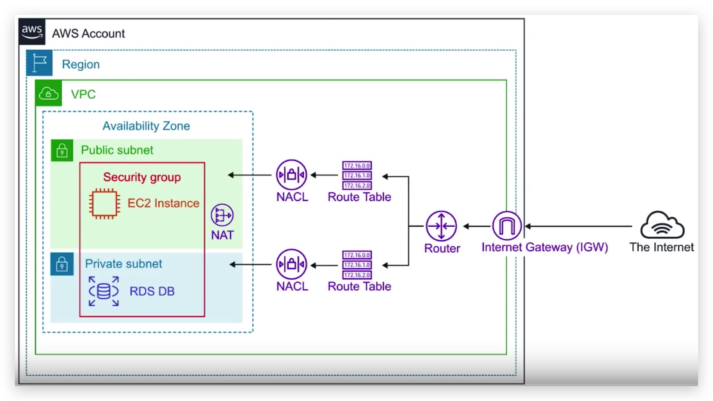

Combining these components and services is what makes up your VPC:

- Internet Gateway (IGW)
- Virtual Private Gateway (VPN Gateway)
- Routing Tables
- Network Access Control Lists (NACLs) - Stateless
- Security Groups (SG) Stateful
- Public Subnets
- Private Subnets
- Nat Gateway
- Customer Gateway
- VPC Endpoints
- VPC Peering

## VPC Key Features

- VPCs are **Region Specific** they do not span regions
- You can create up to **5 VPC** per region
- Every region comes with a default VPC
- You can have **200 subnets** per VPC
- You can use **IPv4 CIDR Block** and in addition to a **IPv6 CIDR Block** (the address of the VPC)
- **Cost nothing**: VPC, Route Table, Nacls, Internet Gateways, Security Groups and Subnets, VPC Peering
- **Some things cost money**: eg. NAT Gateway, VPC Endpoints, VPC Gateway, Customer Gateway
- **DNS hostname**: Your instance have domain name addresses

## Default VPC

AWS has a default VPC in every region so you can **immediately** deploy instances.

- Create a VPC with a size with 16 IPv4 CIDR block (172.31.0.0/16)
- Create a size with 20 **default subnet in each Availability Zone**
- Create a **Internet Gateway** and connect it to your default VPC
- Create a **default security group** and associate it with your default VPC
- Create a **default network access control list (NACL)** and associate it with your default VPC
- Associate the **default DHCP (Dynamic Host Configuration Protocol)** options set for your AWS account with your default VPC
- When you create a VPC, it automatically has a main route table

## Default Everywhere IP

**0.0.0.0/0** is also known as default, it represents **all possible IP addresses**.

When we specify **0.0.0.0/0** in our route table for IGW, we are allowing internet access.

When we specific **0.0.0.0/0** in our security group inbound rules, we are allowing all traffic from the internet access our public resources.

When you see **0.0.0.0/0**, just think of giving access from anywhere or the internet.

## VPC Peering

**VPC Peering** allows you to connect one VPC with another over a **direct network route** using **private IP addresses**.

- Instances on peered VPCs behave just like they are on the **same network**
- Connect VPCs across **same** or **different AWS accounts** and **regions**
- Peering uses a **Star Configuration: 1 Central VPC - 4 other VPCs**
- **No Transitive Peering** (peering must take place directly between VPCs)
  - Needs a one to one connect to immediate VPC
- **No Overlapping CIDR Blocks**

## VPC Route Tables

Route tables are used to determine where **network traffic is directed**.

Each **subnet** in your VPC **must be associated** with a route table, a subnet can only be associated **with one route table at a time**, but you can associate multiple subnets with the same route table.

The Internet -> IGW -> Route -> Route Table -> Public subnet

## VPC Internet Gateway (IGW)

The Internet Gateway allows your VPC **access to the internet**.

IGW does **two** things:

- Provide a target in your VPC route tables for internet-routable traffic
- Perform network address translation (NAT) for instances that have been assigned **public IPv4 addresses**

To route out to the internet you need to add in your route tables you need to add a route.

To the internet gateway and set the Destination to be **0.0.0.0/0**.

## VPC Bastion / Jumpbox

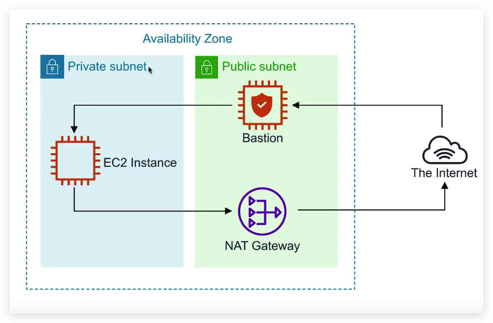

Bastions are EC2 instances which are security harden. They are designed to help you gain access to your EC2 Instances via SSH or RCP. That are in a **private subnet**.

They are also known as Jump boxes because you are jumping from one box to access another.

NAT Gateways/Instances are only intended for EC2 instances to gain outbound access to the internet for things such as security updates.

NATs can't/shouldn't be used as Bastion.

## VPC Direct Connect

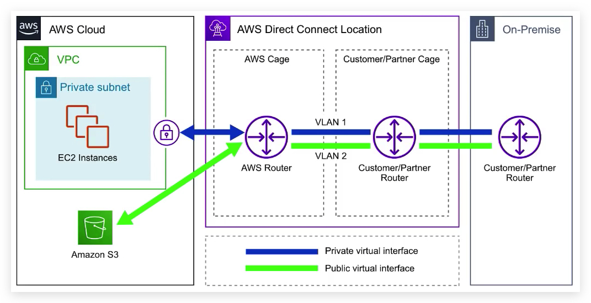

AWS Direct Connect is the AWS solution for establishing **dedicated network** connections from on-premises locations to AWS.

**Very fast network**:

- Lower Bandwidth 50M - 500M
- Higher Bandwidth 1GB or 10 GB

Benefits:

- Help **reduce network costs** and **increase bandwidth throughput**. (great for high traffic networks)
- Provides a **more consistent network experience** than a typical internet-based connection. (reliable and secure)

## VPC Endpoints Introduction

Think of a secret tunnel where you don't have to leave the AWS Network.

There are **two types** of VPC Endpoints:

1. **Interface Endpoint**
2. **Gateway Endpoint**

VPC Endpoints allow you to **privately connect your VPC to other AWS services**.

VPC endpoint services can:

- Eliminate the need for an **Internet Gateway**, **NAT device**, **VPN connection**, or **AWS Direct Connect** connections.
- Instance in the VPC **do not require a public IP address** to communicate with service resource.
- Traffic between your VPC and other services **does not leave the AWS network**.
- **Horizontally scaled**, **redundant**, and **highly available** VPC component.
- Allow secure communication between instances and services **without adding availability risks or bandwidth constraints** on your traffic.

## VPC Interface Endpoints

**Internet Endpoints** are **Elastic Network Interfaces (ENI)** with a **private IP address**.

They serve as an entry point for traffic going to a supported service.

Interface Endpoints are powered by **AWS PrivateLink**, access services hosted on AWS easily and securely by keeping your network traffic within the AWS network.

Interface Endpoints support the following **AWS Services**:

- API Gateway
- CloudFormation
- CloudWatch
- Kinesis
- SageMaker
- Codebuild
- AWS Config
- EC2 API
- ELB API
- AWS KMS
- Secrets Manager
- Security Token Service
- Service Catalog
- SNS
- SQS
- Systems Manager
- Marketplace Partner Services
- Endpoint Services in other AWS accounts

## VPC Gateway Endpoints

A **Gateway Endpoint** is a gateway that is a target for **a specific route** in your **route table**, used for traffic destined for a supported AWS service.

To create a Gateway Endpoint, you must specify the VPC in which you want to create the endpoint, and the service to which you want to establish the connection.

Gateway Endpoints current supports 2 service:

- Amazon S3
- DynamoDB

## VPC Flow Logs Introduction

**VPC Flow Logs** allow you to capture **IP traffic information** in-and-out of Network Interfaces with your VPC.

All log data is **stored** using **Amazon CloudWatch Logs**. After a flow log is created, it can be viewed in detail within CloudWatch Logs.

Flow logs can be created for:

1. **VPC**
2. **Subnets**
3. **Network Interface**

## VPC Network Access Control List Introduction

An optional layer of security that acts as a **virtual firewall** for controlling traffic **in and out of subnets**.

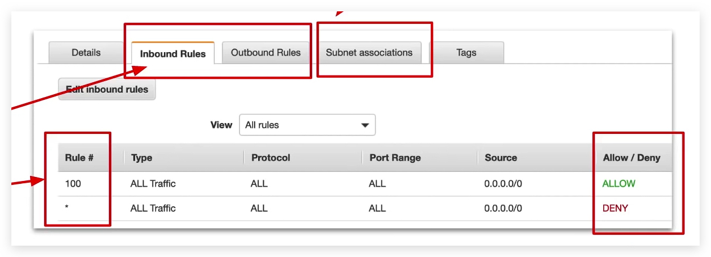

VPCs automatically get a default NACL.

Each NACL contains a set of tules that can **allow** or **deny** traffic **into (inbound) nad out of (outbound) subnets**.

**Rule #** determines the **order of evaluation**. From lowest to highest. The highest rule # can be 32766 and its recommended to work in 10 or 100 increments.

You can allow or deny traffic. You could **block a single IP address** (You can't do this with Security Group).

## VPC NACLs Use Case

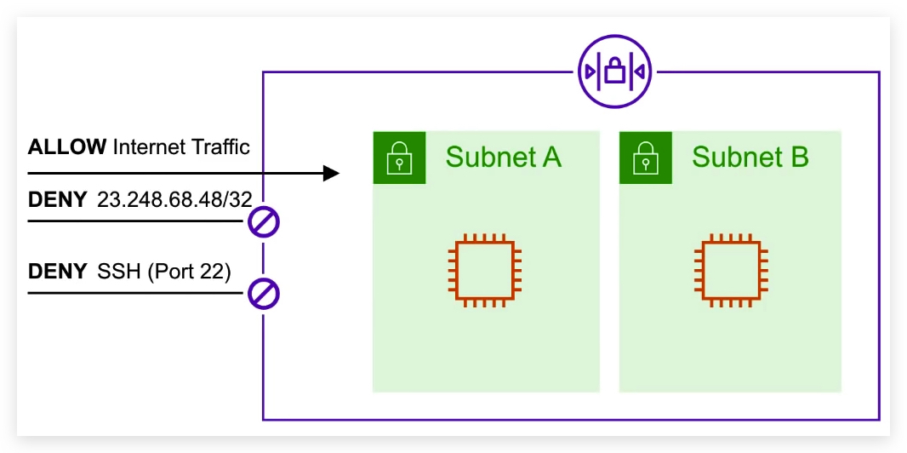

- We determine there is a malicious actor at a specific IP address is trying to access our instances so we **block their IP**.
- We never need to SSH into instances so we add a **DENY for these subnets**. This is just an additional measure in case our Security Groups SSH port was left open.

## VPC Security Groups Introduction

A virtual firewall that controls the traffic to and from EC2 instance.

Security Groups are associated with EC2 instances.

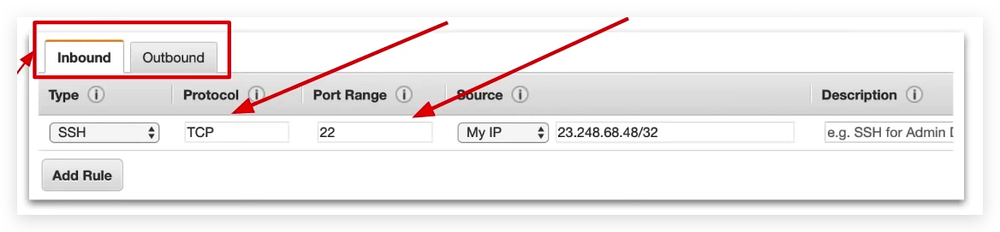

Each Security Group contains a set of rules that filter traffic coming **into(inbound)** and **out of (outbound)** EC2 instances by providing security at the **protocol** and **port** access level.

There are no **_DENY_** rules. **All traffic is blocked** by default unless a rule specifically allows it.

**Multiple Instances** across multiple subnets can belong to a **Security Group**.

## VPC Security Groups Limits

- You can have up to **10,000 Security Groups in a Region** (default is 2,500)
- You can have **60 inbound rules** and **60 outbound rules** per security group
- **16 Security Groups** per ENI - Elastic Network Interface (default is 5)

## VPC Security Groups Use Case

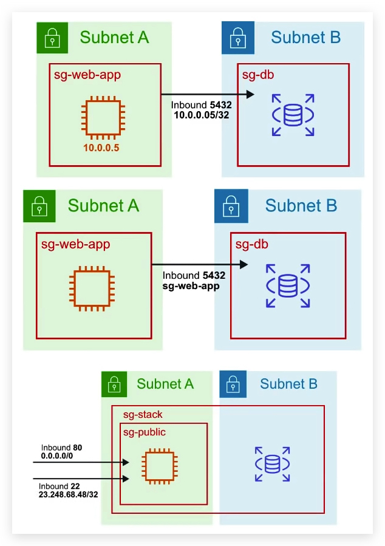

- You can specify the source to be an IP range or A specific IP (/32 is a specific IP address)
- You can specify the source to be another security group
- An instance be **belong to multiple Security Groups**, and rules are **permissive** (instead of restrictive). Meaning if you have one security group which has no Allow and you add an allow to another than it will Allow

## VPC Network Address Translation (NAT)

Network Address Translation (NAT) is the method of **re-mapping** one IP address space into another.

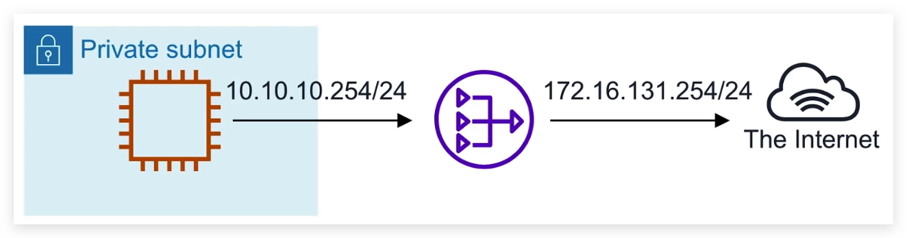

If you have a private network and you need to help gain outbound access to the internet you would need to use a NAT gateway to remap the Private IPs.

If you have two networks which have conflicting network addresses you can use a NAT to make the addresses more agreeable.

## VPC NAT Instances VS NAT Gateways

NATs have to run within a **Public Subnet**.

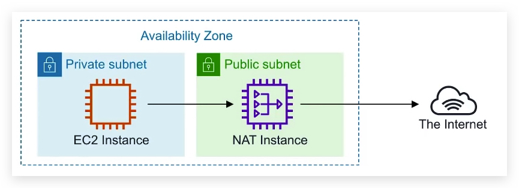

⤴️ **NAT Instances** (legacy) are individual EC2 instances. Community AMIs exist to launch NAT Instances.

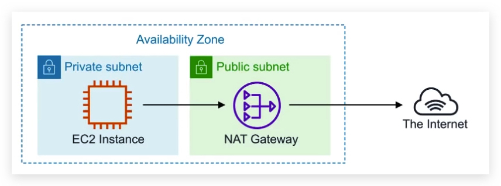

⤴️ **NAT Gateway** is a manged service which launches redundant instances within the selected AZ.

## VPC Cheat Sheet

### Endpoint Cheat Sheet

- VPC Endpoints help keep traffic between AWS Services **within the AWS Network**
- There are two kinds of VPC Endpoints: Interface Endpoints and Gateway Endpoints
- Interface Endpoints **cost money**, Gateway Endpoints are **free**
- Interface Endpoints uses an Elastic Network Interface (ENI) with Private IP (powered by AWS PrivateLink)
- Gateway Endpoints is a target for a specific route in your route table
- Interface Endpoints support many AWS services
- Gateway Endpoints only support DynamoDB and S3

### Flow Logs Cheat Sheet

- **VPC Flow Logs** monitor the in-and-out traffic of your Network Interfaces with your VPC
- You can turn on Flow Logs at the VPC, Subnets, or Network Interface level
- VPC Flow Logs **cannot be tagged** like other AWS resources
- You **can not change the configuration** of a flow log **after it's created**
- You **can not enable** flow logs for VPCs which are peered with your VPC **unless it is in the same account**
- VPC Flow Logs can be delivered to an **S3** or **CloudWatch Logs**
- VPC Flow Logs contains the source and destination **IP addresses** (not hostname)
- Some instance traffic is **not monitored**:
  - Instance traffic generated by contacting the AWS DNS servers
  - Windows license activation traffic from instances
  - Traffic to and from the instance metadata address (169.254.169.254)
  - DHCP Traffic
  - Any traffic to the reserved IP address of the default VPC router

### NACLs Cheat Sheet

- Network Access Control List is commonly known as NACL
- VPCs are automatically given a default NACL which allow **all outbound and inbound** traffic
- Each subnet with a VPC must be associated with a NACL
- Subnets can only be associated with 1 NACL at a time. Associating a subnet with a new NACL will remove the previous association
- If a NACL is not explicitly associated with a subnet, the subnet will automatically be associated with the default NACL
- NACL has inbound and outbound rules, just like Security Groups
- Rule can either **allow** or **deny** traffic, unlike Security Groups which can only allow
- NACLs are STATELESS, which means any allowed inbound traffic is also allowed outbound
- When you create a NACLs, it will deny all traffic by default
- NACLs contain a numbered list of rules that gets evaluated in order from lowest to highest
- If you needed a block a single IP address, you could via NACLs (Security Groups cannot deny)

### Security Group Cheat Sheet

- Security Groups acts as a firewall at the instance level
- Unless allowed specifically, all **inbound traffic** is **blocked by default**
- All **Outbound traffic** from the instance is **allowed by default**
- You can specific for the source to be either an IP range, single IP Address or another security group
- Security Groups are **STATEFUL** (if traffic is allowed inbound, then it is also allowed outbound)
- Any changes to a Security Group take effect immediately
- EC2 Instances can belong to multiple security groups
- Security groups can contain multiple EC2 Instances
- You **cannot block specific IP addresses** with Security Groups, for this you would need a Network Access Control List (NACL)
- You can have up to 10,000 Security Groups per Region (default is 2,500)
- You can have 60 inbound and 60 outbound rules per Security Group
- You can have 16 Security Group associated to an ENI (default is 5)

### NAT Instance and NAT Gateway Cheat Sheet

- When creating a NAT instance you **must disable source and destination checks** on the instance
- NAT instances **must exist in a public subnet**
- You must have a **route out** of the private subnet to the NAT instance
- The size of a NAT instance determines **how much traffic can be handled**
- **High availability** can be achieved using **Autoscaling Groups**, multiple **subnets in different AZs**, and **automate failover between them using a script**.
- NAT Gateways are **redundant inside an Availability Zone** (can survive failure of EC2 instance)
- You can only have **1 NAT Gateway inside 1 Availability Zone** (cannot span AZs)
- Starts at 5 Gbps and scales all the way up to 45 Gbps
- NAT Gateways are the **preferred setup for enterprise systems**
- There is **no requirement to patch NAT Gateways**, and there is **no need to disable Source/Destination checks** for the NAT Gateway (unlike NAT Instances)
- NAT Gateways are **automatically assigned a public IP address**
- **Route Tables** for the NAT Gateway MUST be updated
- Resources in multiple AZs sharing a Gateway will **lose internet access if the Gateway** goes down, unless you create a **Gateway in each AZ** and configure **route tables** accordingly

# Identity Access Management (IAM)

## IAM Core Component

IAM allows **management** of access of **users** and **resource**

### IAM Identities

- IAM **Users**: End users who log into the console or interact with AWS resource programmatically
- IAM **Groups**: Group up your Users so they all share permission levels of the group eg. Administrators, Developers, Auditors
- IAM **Roles**: Associate permissions to a Role and then assign this to an Users or Groups

### IAM Policies

JSON documents which grant permissions for a specific user, group, or role to access services. Policies are **attached to the IAM Identities**.

### Use case

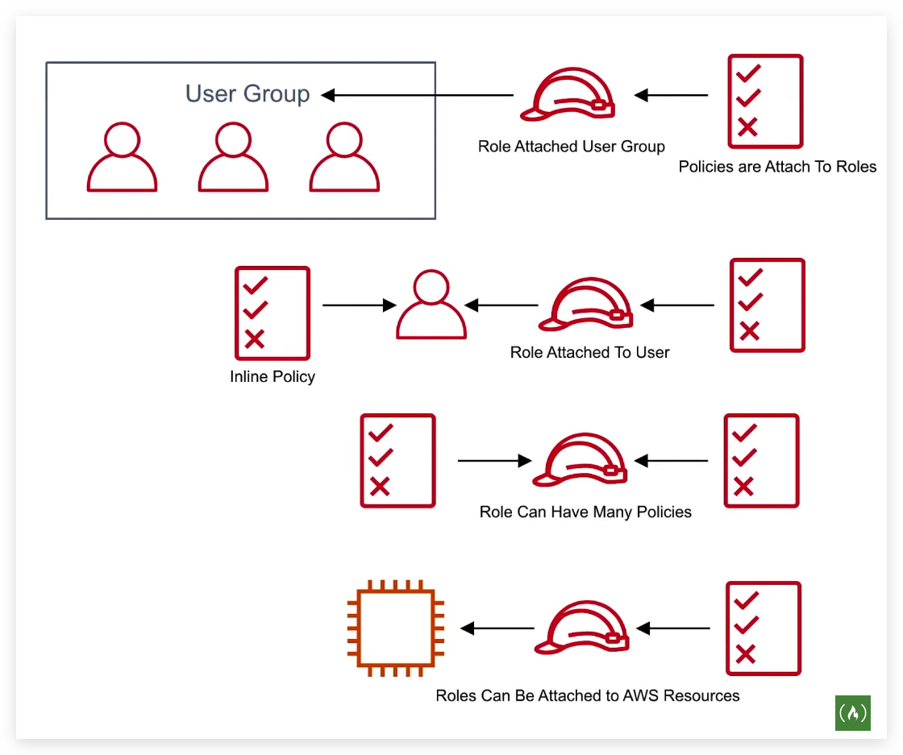

- A user can belong to a group. Roles can be applied to groups to quickly add and remove permissions en-masse to users
- A user can have a role directly attached. An policy can be directly attached to a user (called an **Inline Policy**)
- Roles can have many policies attached
- Various AWS resources allow you attache roles directly to them

## IAM Types of Policies

- **Managed Policies**: A policy which is managed by AWS, which you cannot edit. Managed policies are labeled with an orange box.
- **Customer Managed Policies**: A policy created by the customer which is editable. Customer policies have no symbol beside them.
- **Inline Policies**: A policy which is directly attached to the users.

## IAM Policies Structure

Policies Example:

```JSON
{
  "Version": "2012-10-17",
  "Statement": [{
      "Sid": "Deny-Barclay-S3-Access",
      "Effect": "Allow",
      "Action": [
        "s3:ListAllMyBuckets"
      ],
      "Resource": "arn:aws:s3:::*"
    },
    {
      "Effect": "Allow",
      "Action": [
        "s3:ListBucket",
        "s3:GetBucketLocation"
      ],
      "Resource": "arn:aws:s3:::examplebucket",
      "Condition": {
        "NumericLessThanEquals": {
          "aws:MultiFactorAuthAge": "3600"
        }
      }
    },
    {
      "Effect": "Allow",
      "Action": [
        "s3:PutObject",
        "s3:PutObjectAcl",
        "s3:GetObject",
        "s3:GetObjectAcl",
        "s3:DeleteObject"
      ],
      "Resource": "arn:aws:s3:::examplebucket/*",
      "Condition": {
        "NumericLessThanEquals": {
          "aws:MultiFactorAuthAge": "3600"
        }
      }
    }
  ]
}
```

- **Version**: Policy language version. `2012-10-17` is the latest version
- **Statement**: container for the policy element you are allowed to have multiples
- **Sid(optional)**: a way of labeling your statements
- **Effect**: Set whether the policy will `Allow` or `Deny`
- **Principal**: account, user, role or federated user to which you would like to allow or deny access
- **Action**: list of actions that the policy allows or denies
- **Resource**: the resource to which the action(s) applies
- **Condition(optional)**: circumstances under which the policy grants permission.

## IAM Password Policy

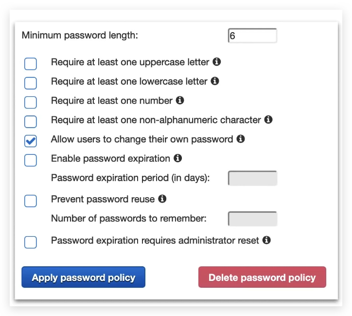

In IAM you can set a **Password Policy** to set the minimum requirements of a password and **rotate** passwords so users have to update their passwords after certain days.

## IAM Programmatic Access Keys

Access Keys allow users to interact with AWS service **programmatically** via the **AWS CLI** or **AWS SDK**.

You're allowed **two** Access Keys per user.

## IAM Multi-Factor Authentication

Multi-factor authentication (MFA) can be turned on per user.

The user has to turn on MFA **themselves**, Administrator **cannot directly enforce** users to have MFA.

The Administrator account could **create a policy** requiring MFA to access certain resources.

## IAM Cheat Sheet

- **Identity Access Management** is used to manage **access** to users and resources
- IAM is a universal system, which applies to all regions at the same time
- IAM is a free service
- A root service is the account initially created when AWS is set up (full administrator)
- New IAM accounts have no permissions by default until granted
- New users get assigned an Access Key Id and Secret when first created when you give them programmatic access
- Access Keys are only used for CLI and SDK (cannot access console)
- Access keys are only shown once when created. If lost, they must be deleted/recreated again
- Always setup MFA for Root Accounts
- Users must enable MFA on their own, Administrator cannot turn it on for each user
- IAM allows your set password policies to set minimum password requirements or rotate passwords
- **IAM Identities** as Users, Groups, and Roles
- **IAM Users**: End users who log into the console or internet with AWS resources programmatically
- **IAM Groups**: Group up your Users so they all share permission levels of the group eg. Administrators, Developers, Auditors
- **IAM Roles**: Associate permissions to a Role and then assign this to an Users or Groups
- **IAM Policies**: JSON documents which grant permissions for a specific user, group, or role to access services
- Policies are attached to IAM Identities
- **Managed Policies** are policies provided by AWS and cannot be edited
- **Customer Managed Policies** are policies created by user/customer, which you can edit
- **Inline Policies** are policies which are directly attached to a user

# Amazon Cognito

## Amazon Cognito Introduction

Decentralized Managed **Authentication**.

Sign-up, Sign-in integration for your apps. Social identity provider eg. Facebook, Google.

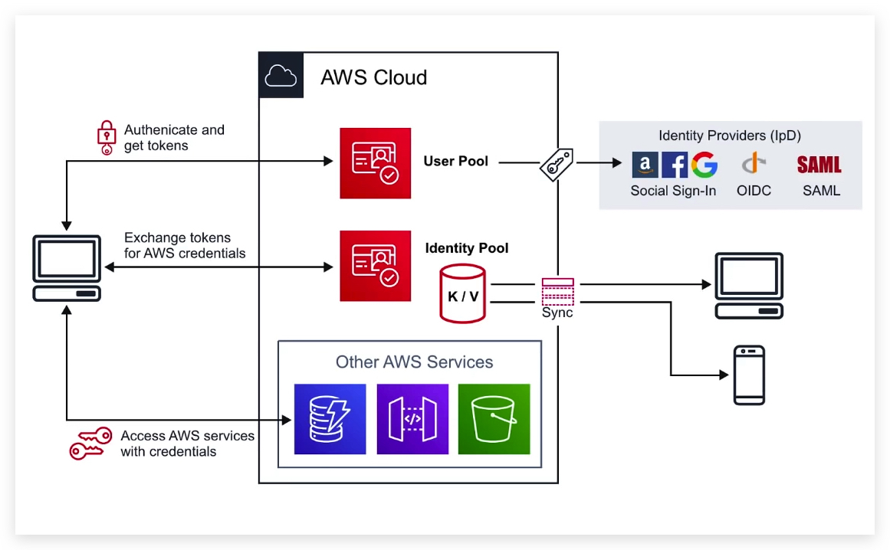

- **Cognito User Pools**: User directory with authentication to Identity Provider (IpD) to grant access to your app
- **Cognito Identity Pools**: Provide temporary credentials for users to access AWS Services
- **Cognito Sync**: Syncs user data and preferences across all devices

## Amazon Cognito Web Identity Federation

### Web Identity Federation

To exchange identity and security information between an identity provider (IdP) and an application.

### Identity Provider (IdP)

A trusted provider of your user identity that lets you use authenticate to access other services. Identity Providers could be: Facebook, Amazon, Google, Twitter, Github, LinkedIn.

### Types of Identity Providers

The technology that behind the Identity Providers:

- **Single Sign On (SSO)**: Security Assertion Markup Language (SAML)
- **OpenID Connect (OIDC)**: OpenID - Web Identity Federation:

## Amazon Cognito User Pools

User Pool are user directories used to manage the actions for web and mobile apps such as:

- **Sign up**
- **Sign in**
- **Account recovery**
- **Account information**

### User Pools Feature

- Allow users to sign-in directly to the User Pool, or using Web Identity Federation
- Use AWS Cognito as the identity broker between AWS and the identity provider
- Successful user authentication generates a JSON Web Token (JWTs)
- User Pools can be thought of as **the account used to access the system** (ie. email address and password)

### User Pools Settings

- Choose what attributes
- Choose password requirements
- Apply MFA
- Restrict whether users are allow to sign up on their own or need admin verification
- Analytics with PinPoint for user campaigns
- Trigger customer log via Lambdas after actions such as after sign-up

## Amazon Cognito Identity Pools

**Identity Pools** provide **temporary AWS credentials** to access services eg. S3, DynamoDB.

Identity Pools can be thought of as the actual mechanism authorizing access to **the AWS resources**.

## Amazon Cognito Sync

Sync **user data** and **preferences** across devices with one line of code.

Cognito uses **push synchronization** to push updates and synchronize data.

Use **Simple Notification Service (SNS)** to send notifications to all user devices when data in the cloud changes.

## Amazon Cognito Cheat Sheet

- Cognito is decentralized managed authentication system. When you need to easily add authentication to your mobile and desktop app think Cognito
- **User Pools** user directory, allows users to authenticate using OAuth to IpD such as Facebook, Google, Amazon to connect to web-applications. Cognito User Pools is in itself a IpD
- User Pools use **JWT**s for to persist authentication
- **Identity Pools** provides **temporary AWS credentials** to access service eg. S3, DynamoDB
- **Cognito Sync** can sync **user data** and **preferences** across devices with one line of code (powered by SNS)
- **Web Identity Federation** exchange identity and security information between an identity provider (IdP) and an application
- **Identity Provider (IdP)** is a trusted provider of your user identity that lets you use authenticate to access other services, eg. Facebook, Twitter, Google, Amazon
- **OIDC** is a type of Identity Provider which uses OAuth
- **SAML** is a type of Identity Provider which is used for Single Sign-on

# AWS CLI & SDK

## AWS Command Line Interface (CLI)

Control multiple AWS service from the command line and automate them through scripts.

The **AWS CLI** let you interact with AWS from anywhere by simply using a command line.

**You can from the CLI perform actions such as**:

- List buckets, upload data to S3
- Launch, stop, start and terminate EC2 instance
- Update security groups, create subnets
- etc...

**Important AWS CLI flags to know**:

- Easily switch between AWS accounts using `--profile`
- Change the `--output` between json, table and text

## AWS Software Development Kit (SDK)

**Control** multiple AWS services using popular programming languages.

A Software Development Kit (SDK) is a set of tools and libraries that you can use to create applications for a specific software package.

The AWS SDK is a set of API libraries that let you integrate AWS services into your applications.

The SDK is available for **the following languages**:

- C++
- Go
- Java
- JavaScript
- .NET
- Node.js
- PHP
- Python
- Ruby

## AWS Programmatic Access - Access Key and Secret

When you enable **Programmatic Access** for AWS users:

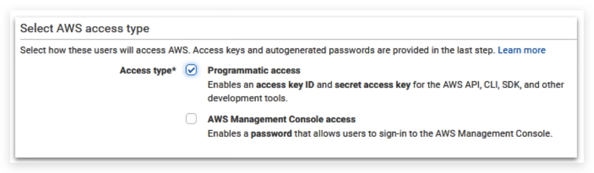

You'll have the ability to create **Access Key ID** and **Secret Access Key**, which are collectively known as **AWS Credentials**.
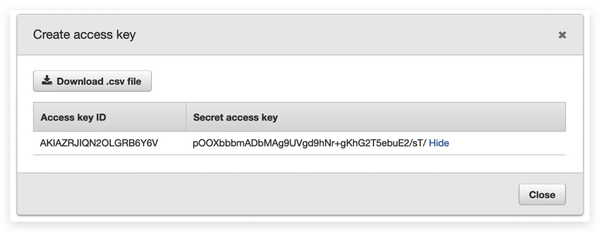

You will want to store you credentials in your home directory `~/.aws/credentials`.

The credentials files allow you to manage multiple credentials (called **profiles**).

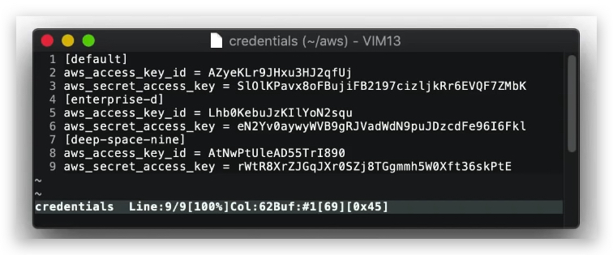

## AWS CLI & SDK Cheat Sheet

- **CLI** stands for Command Line Interface
- **SDK** stands for Software Development Kit
- The **AWS CLI** lets you interact with AWS from anywhere by simply using a command line
- The **AWS SDK** is a set of API libraries that let you integrate AWS services into your applications
- **Programmatic Access** must be enabled per user via the IAM console to use CLI or SDK
- **AWS Configure** command used to setup your AWS Credentials for the CLI
- The CLI is installed via a Python script
- Credentials get stored in a plain text file whenever possible use roles instead of AWS credentials
- The SDK is available for **the following languages**:
  - C++
  - Go
  - Java
  - JavaScript
  - .NET
  - Node.js
  - PHP
  - Python
  - Ruby

# AWS Domain Name System (DNS)

## DNS - Introduction

The Phonebook of the Internet.

DNS **translates domain name to IP addresses**, so browsers can find Internet resources.

**Domain Name System (DNS)** is the service which handles **converting** a domain name into a routable **Internet Protocol (IP)** address (ie 52.216.8.34).

This is what allows your computer to **find specific servers** on the internet automatically **depending what domain name** you browser to.

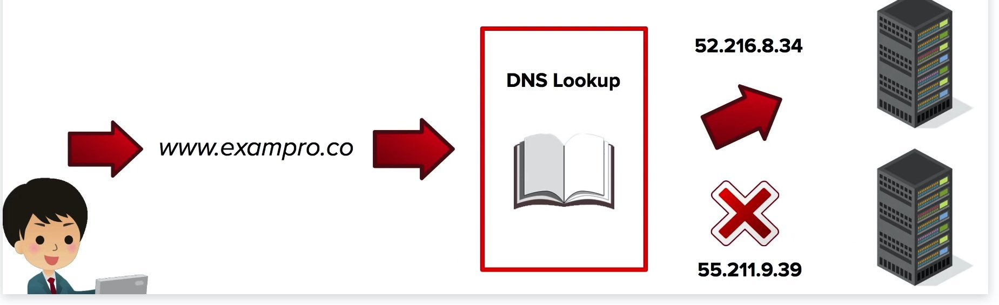

## DNS - Internet Protocol (IP)

IP Addresses are what uniquely identifies each computer on a network, and allows communication between them using the Internet Protocol (IP).

### IPv4 - Internet Protocol Version 4

Example: **52.216.8.34**

Address space is **32-bits** with up to **4,294,967,296** available addresses.

### IPv6 - Internet Protocol Version 6

Example: **2001:0db8:85a3:0000:0000:8a2e:0370:7334**

Address space is **128-bits** with up to **340 undecillion potential addresses (1+36 Zeros)**.

Invented to solve available address limitation of IPv4.

## DNS - Domain Registrars

Domain Registrars are authorities who **have the ability to assign domain names** under one or more **top-level-domains**.

Domains get registered through **InterNIC**, which is a service provided by the **Internet Corporation for Assigned Names and Numbers (ICANN)**, and enforces the uniqueness of domain names all over the internet.

After registration, all domain names can be found publicly in a central **WhoIS database**.

## DNS - Top Level Domain

The **last word** within a domain name represents the **top-level domain (TLD)** name.

- apple.**com**

The **second word** within a domain name is known as the **second-level domain (SLD)** name.

- apple.**com**.cn

All available top level domains are stored in a public database at:

```
https://www.iana.org/domains/root/db
```

## DNS - Start of Authority (SOA)

Every domain **must have an SOA record**. The SOA is a way for the Domain Admins to provide information about the domain, such as, how often it's updated, what is the administrator's email address and etc.

A **Zone** file can contain only one SOA record.

### Structure of SOA

|  Key Name   |                                                    Description                                                    |
| :---------: | :---------------------------------------------------------------------------------------------------------------: |
|  **NAME**   |                                                 name of the zone                                                  |
|   **IN**    |                                       zone class (usually IN for internet)                                        |
|   **SOA**   |                                        abbreviation for Start of Authority                                        |
|  **NNAME**  |                                     Primary master name server for this zone                                      |
|  **RNAME**  |                                   Email of the admin responsible for this zone                                    |
| **SERIAL**  |                                            Serial number for this zone                                            |
| **REFRESH** | **Seconds** after which secondary name servers should query the master for the SOA record, to detect zone changes |
|  **RETRY**  |          **Seconds** after which secondary NS should retry request serial number if unresponsive master           |
| **EXPIRE**  |        **Seconds** after which secondary NS should stop answering request for zone if unresponsive master         |
|   **TTL**   |                                   Time To Live for purposes of negative caching                                   |

## DNS - Address Records

**Address Records (A Records)** are one of the fundamental types of DNS records.

An Address Record allows you to convert the **name of a domain** directly into **an IP address**. They can also be used on the root (naked domain name) itself.

We have `testing-domain.com` (naked domain name) using a A record to directly to a web-server IP address of 52.216.8.34

```JSON
{
  "ResourceRecordSets": [{
    "TTL": 300,
    "TYPE": "A",
    "Name": "testing-domain.com",
    "ResourceRecords": [{
      "Value": "52.216.8.34"
    }]
  }]
}
```

## DNS - CNAME Records

**Canonical Name (CNAME)** are another fundamental DNS records used to **resolve one domain name to another, rather than an IP address**.

The advantage of CNAME is they are unlikely to change where IP addresses can change over time (if it's a dynamic IP address).

We have `testing-domain.com` (naked domain name) using an A record to redirect our `www.testing-domain.com`.

```JSON
{
  "ResourceRecordSets": [{
    "TTL": 300,
    "TYPE": "CNAME",
    "Name": "testing-domain.com",
    "ResourceRecords": [{
      "Value": "www.testing-domain.com"
    }]
  }]
}
```

## DNS - Name Server Records (NS)

**Name Server Records (NS)** are used by **top-level domain servers** to direct traffic to the DNS server containing the authoritative DNS records. Typically multiple name servers are provided for redundancy.

If you were managing your DNS records with Route53. The **NS Records** for your domain name would be pointing at the AWS servers.

```JSON
{
  "Type": "NS",
  "ResourceRecordSets": [{
    "Name": "testing-domain.com",
    "TTL": 172800,
    "ResourceRecords": [{
      "Value": "ns-245.awsdns-30.com."
    }, {
      "Value": "ns-523.awsdns-01.net."
    }, {
      "Value": "ns-1586.awsdns-06.co.uk."
    }, {
      "Value": "ns-1373.awsdns-43.org."
    }]
  }]
}
```

## DNS - Time To Live (TTL)

Time-To-Live (TTL) is the **length of time that a DNS record gets cached** on the resolving server or the users own local machine.

**The lower the TTL, the faster that changes to DNS records** will propagate across the internet.

TTL is always measured in seconds under IPv4.

## DNS - Cheat Sheet

- **Domain Name Service (DNS)**: Internet service that converts domain names into routable IP addresses
- **IPv4**: Internet Protocol Version 4 with 32 bit address space (**limited** number of addresses)
- IPv4 Example: **52.216.8.34**
- **IPv6**: Internet Protocol Version 6 with 128 bit address space (**unlimited** number of addresses)
- IPv6 Example: **2001:0db8:85a3:0000:0000:8a2e:0370:7334**
- **Top Level Domain**: example.**com** **last part** of the domain
- **Second Level Domain**: example.**co**.uk **second last part** of the domain
- **Domain Registrar**: Third party company who you register domains through
- **Name Server**: The server(s) which contain the DNS records for a domain
- **Start of Authority (SOA)**: Contain information about the DNS zone and associated DNS records
- **A Record**: DNS record which directly converts a domain name into an IP address
- **CNAME Record**: DNS record which let you convert a domain name into another domain name
- **Time To Live (TTL)**: The time that a DNS record will be cached for (lower time means changes propagate faster)

# AWS Route 53

## Route 53 - Introduction

Highly available and scalable cloud Domain Namer System (DNS).

Register and manage domain, create DNS routing rules.

Route 53 is a Domain Name Service (DNS), think Godaddy or NameCheap but with more synergies with AWS services.

You can:

- Register and manage domains
- Create various records sets on a domain
- Implement complex traffic flows, eg. Blue/Green deploy, failover
- Continuously monitor records via health check
- Resolve VPC's outside of AWS

## Route 53 - Use Case

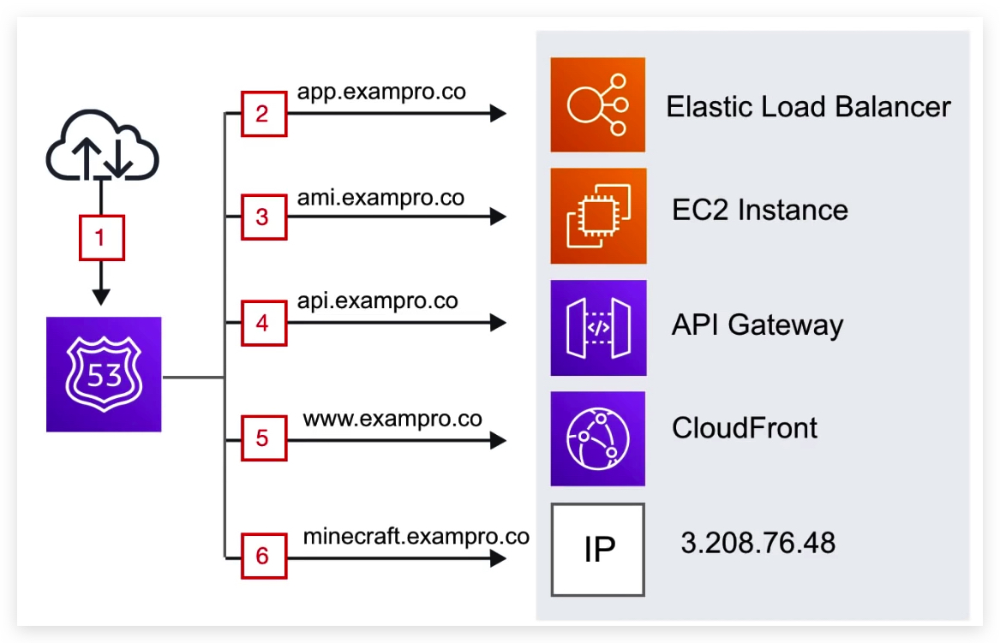

Use Route 53 to get your custom domains to point to your AWS Resource:

1. Incoming internet traffic
2. Route traffic to our web-app backed by Application Load Balancer
3. Route traffic to an instance we use to tweak our AMI
4. Route traffic to API gateway which powers our API
5. Route traffic to CloudFront which servers our S3 static hosted website
6. Route traffic to an Elastic IP (EIP) which is a static IP that hosts our company Minecraft server

## Route 53 - Record Sets

We create record sets which allows us to point our naked domain and subdomains via Domain records.

For example, we can send our `www` subdomain using an A record to point a specific IP address.

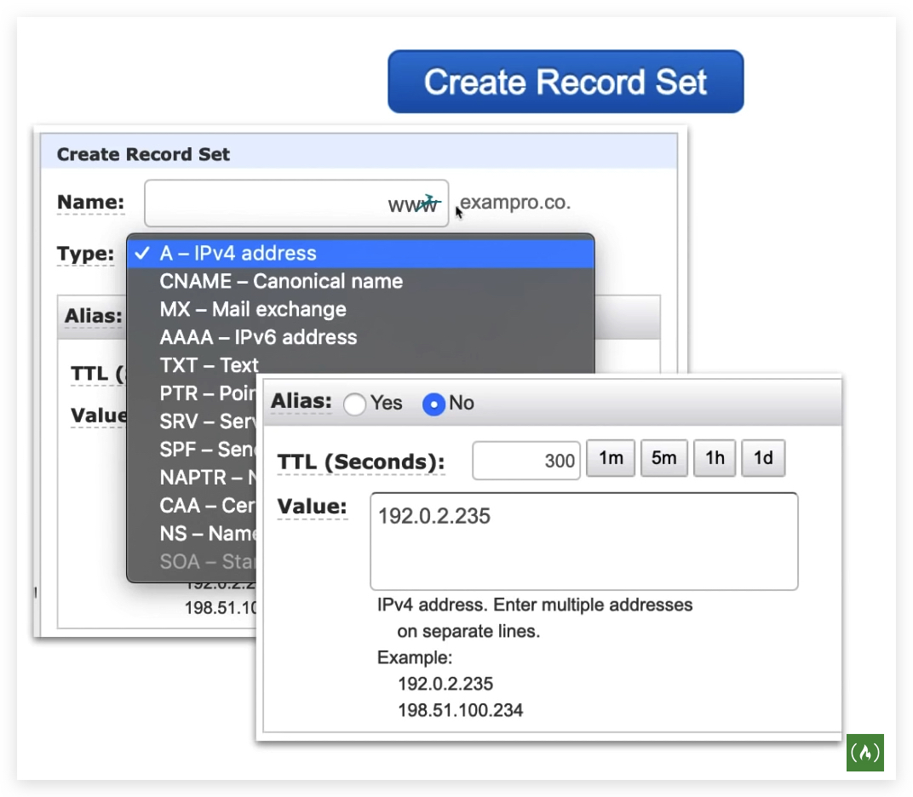

## Route 53 - Alias Record

AWS has their own special **Alias Record** which extends DNS functionality. It will route traffic to specific AWS resources.

Alias records are smart where they can **detect the change of an IP address** and continuously keep that endpoint pointed to the correct resource.

In most cases you wan to be using **Alias** when routing traffic to AWS resource.

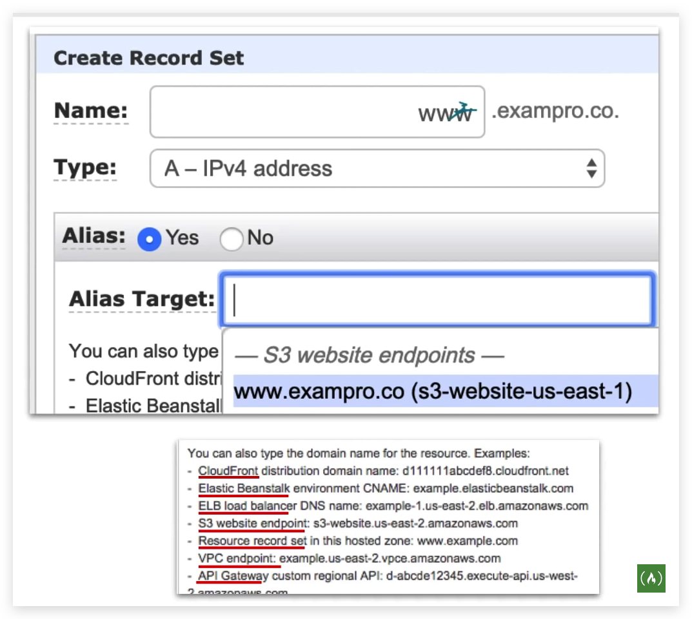

## Route 53 - Traffic Flow

A visual editor lets you create sophisticated routing configuration for your resources using existing routing types.

## Route 53 - Routing Policies

There are **7 different types** of Routing Policies available inside Route 53.

- **Simple Routing**: default routing policy, multiple addresses result in random selection
- **Weighted Routing**: route traffic based on weighted values to split traffic
- **Latency-based Routing**: route traffic to region resource with lowest latency
- **Failover Routing**: route traffic if primary endpoint is unhealthy to secondary endpoint
- **Geolocation Routing**: route traffic based on the location of your suers
- **Geoproximity Routing**: route traffic based on the location of your resource and, optionally, shift traffic form resources in one location to resources in another
- **Multi-value Answer Routing**: respond to DNS queries with up to eight healthy records selected at random

## Route 53 - Simple Routing Polices

**Simple Routing Policies** are the most basic routing policies in Route 53 (**Default Policy**):

- You have 1 record and provide multiple IP address
- When multiple values are specified for a record, Route 53 will return all values back to the user in a **random order**

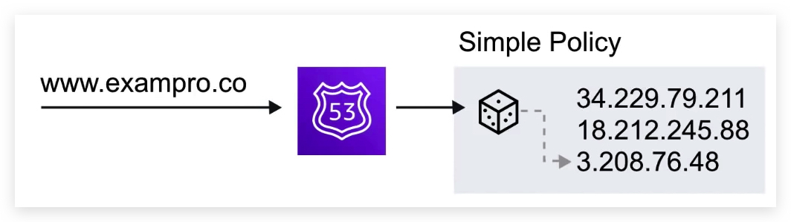

For example, if you had a record for `www.exampro.co` with 3 different IP address values, users would be directly **randomly to 1 of them** when visiting the domain.

## Route 53 - Weighted Routing Polices

**Weighted Routing Polices** let you split up traffic **based on different weights** assigned.

This allows you to send a certain percentage of overall traffic to one server, and have any other traffic apart from that directed to a completely different server.

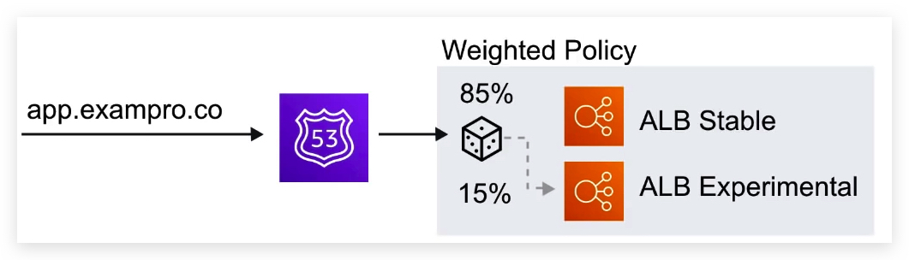

For example, if you had an ALB running experimental features you could test against a small amount traffic at random to minimize the impact of affect.

## Route 53 - Latency Based Routing Policies

**Latency Based Routing** allows you to direct traffic based on the lowest network latency possible for your end-user **based on region**.

Requires a latency resource record to be set for the EC2 or ELB resource that hosts your application in each region.

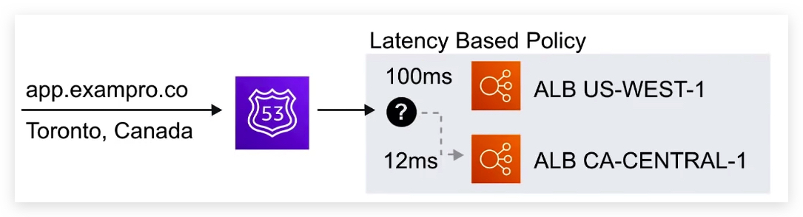

For example, you have two copies of your web-app backed by ALB. One in California, US and another in Montreal, Canada. An request comes in from Toronto, it will be routed to Montreal since it wil have lower latency.

## Route 53 - Failover Routing Policies

**Failover Routing Policies** allow you to create active/passive setups in situations where you want a primary site in one location, and a secondary data recovery site in another.

Route 53 automatically monitors health-checks from you primary site to determine the health of end-points. If an end-point is determined to be in failed state, all traffic is automatically directed to the secondary location.

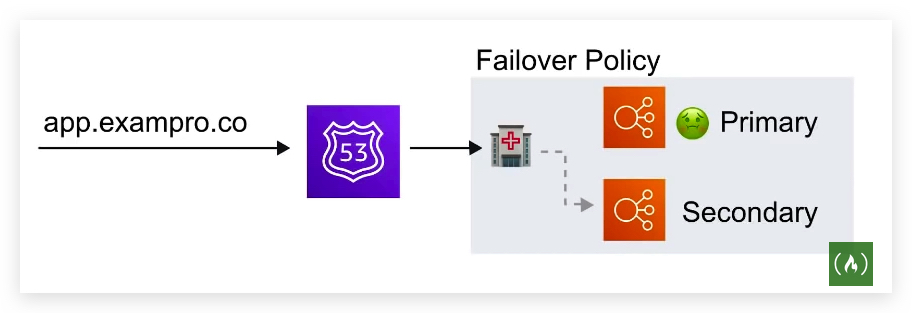

For example, we have a primary and secondary web-app backed by ALB. Route 53 determines our primary is unhealthy and fails over to secondary ALB.

## Route 53 - Geolocation Routing Policies

**Geolocation Routing Policies** allow you to direct traffic based on the geographic location of where the request originated from.

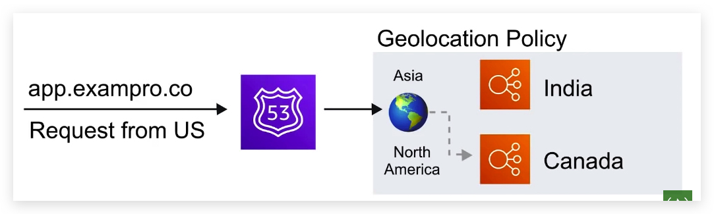

For example, this would let you route all traffic coming from North America to servers located in North American regions, where queries from other region could be directed to servers hosted in that region.

## Route 53 - Geoproximity Routing Policies

**Geoproximity Routing Policies** allow you to direct traffic based on the geographic location of your users, and your AWS resources.

You can route more or less traffic to a specific resource by specifying a **Bias value**.

**Bias value** expands or shrinks the size of the geographic region from which traffic is routed to. **You must use Route 53 Traffic Flow** in order to use geoproximity routing policies.

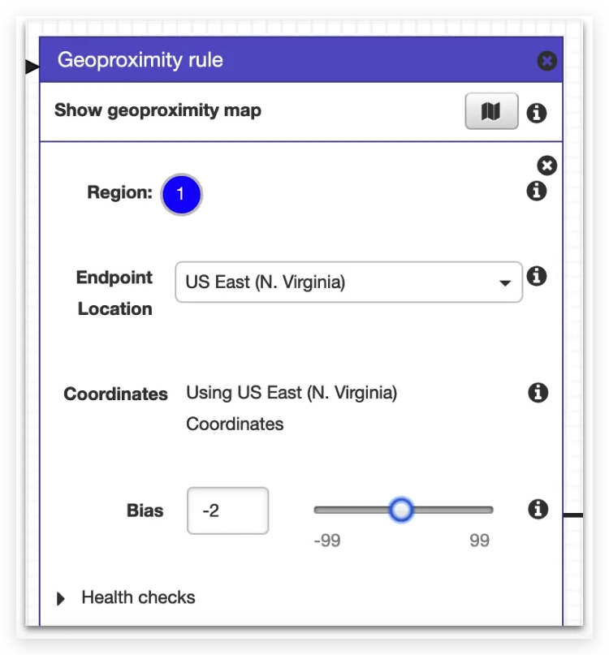

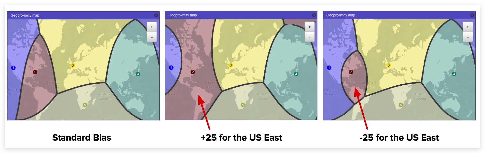

## Route 53 - Multi-Value Answer Policies

**Multi-Value Answer Policies** let you configure Route 53 to return multiple values such as IP addresses for your web-servers, in response to DNS queries.

Multiple values can be specified for almost any record. Route 53 automatically performs health checks on resources and only returns values of ones deemed healthy.

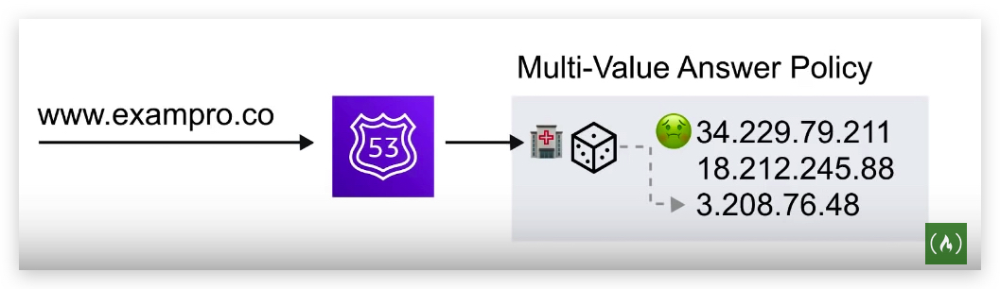

Similar to Simple Routing, however with an added health check for your record set resources.

## Route 53 - Health Check

- Checks health **every 30 seconds** by default, can be reduced to **every 10 seconds**
- A health check can **initial a failover** if status is returned unhealthy
- A **CloudWatch Alarm** can be created to alert you of status unhealthy
- A health check can **monitor other health checks** to create a chain of reactions

## Route 53 - Resolver

Formally known as `.2 resolver`.

A regional service that lets you route DNS queries between your VPCs and your network.

DNS Resolution for **Hybrid Environment (On-Premise and Cloud)**.

## Route 53 - Cheat Sheet

- Route 53 is a DNS provider, register and manage domains, create records sets. Think Godadday or NameCheap.
- **Simple Routing** - Default routing policy, multiple addresses result in a random endpoint selection
- **Weighted Routing** - Split up traffic based on weighted values to split traffic (percentages)
- **Latency-based Routing** - Directs traffic based on region, for lowest possible latency for users
- **Failover Routing** - Primary site in one location, secondary data recovery site in another (change on health check)
- **Geolocation Routing** - Route traffic based on the geographic location of a request origin.
- **Geoproximity Routing** - Route traffic based on geographic location using 'Bias' values (need Route 53 Traffic Flow)
- **Multi-value Answer Routing** - Return multiple values in response to DNS queries (using health check)
- Traffic Flow - visual editor, for changing routing policies, can version policy records for easy rollback
- AWS Alias Record - AWS's smart DNS record, detects changed IPs for AWS resources and adjusts automatically
- Route 53 Resolver - Let you regionally route DNS queries between your VPCs and your network **Hybrid Environments**
- Health check can be created to monitor and automatically over endpoints. You can have health checks monitor other health checks

# AWS Elastic Cloud Computer (EC2)

## EC2 - Introduction

Elastic Cloud Computer is a Cloud Computing Service, which you can choose your **OS**, **Storage**, **Memory**, **Network Throughput**.

Launch and SSH into your service **within minutes**.

EC2 is a **highly configurable server**.

EC2 is resizable **computer capacity**. It take **minutes** to launch new instances.

Anything and everything on AWS uses EC2 Instance underneath.

## EC2 - Instance Types and Usage

### General Purpose

- **Name**: A1 T3 T3a T2 M5 M5a M4
- **Description**: Balance of computer, memory and networking resources
- **Use Cases**: Web server and code repositories

### Compute Optimized

- **Name**: C5 C5n C4
- **Description**: Ideal for computer bound applications that benefit from high performance processor
- **Use Cases**: Scientific modeling, dedicated gaming servers and ad server engines

### Memory Optimized

- **Name**: R5 R5a X1e X1 z1d
- **Description**: Fast performance for workloads that process large data sets in memory
- **Use Cases**: In-memory caches, In-memory databases, real time big data analytics

### Accelerated Optimized

- **Name**: P3 P2 G3 F1
- **Description**: Hardware accelerators, or co-processors
- **Use Cases**: Machine Learning, computational finance, seismic analysis, speech recognition

### Storage Optimized

- **Name**: I3 I3en D2 H1
- **Description**: High, sequential read and write access to very large data sets on local storage
- **Use Cases**: NoSQL, in-memory or transactional databases, data warehousing

## EC2 - Instance Sizes

EC2 Instance Sizes **generally double** in price and key attributes.

|   Name    | vCPU | RAM (GiB) | On-Demand per hour | On-Demand per month |
| :-------: | :--: | :-------: | :----------------: | :-----------------: |
| t2.small  |  1   |    12     |      \$0.023       |       \$16.79       |
| t2.medium |  2   |    24     |      \$0.0464      |       \$33.87       |
| t2.large  |  2   |    36     |      \$0.0928      |       \$67.74       |
| t2.xlarge |  4   |    54     |      \$0.1856      |      \$135.48       |

## EC2 - Instance Profile

Instead of embedding your AWS credentials (Access Key and Secret) in your code so your Instance has permissions to access certain services you can **Attach a role to an instance** via an **Instance Profile**.

You want to **always avoid embedding your AWS credentials** when possible.

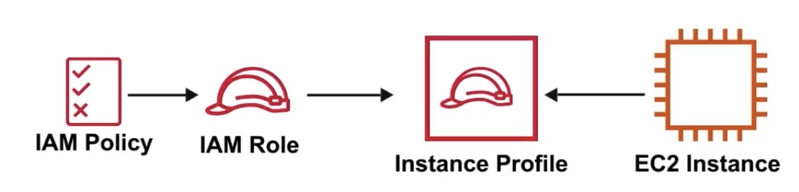

An **Instance Profile** holds a reference to a role. The EC2 instance is associated with the Instance Profile. When you select an IAM role when launching an EC2 instance, AWS will automatically create the Instance Profile for you. Instance Profiles are not easily viewed via the AWS Console.

## EC2 - Placement Groups

Placement Groups let you to choose **the logical placement** of your instances to optimize for **communication**, **performance**, or **durability**. Placement groups are **free**.

### Cluster

- Pack instances close together inside an AZ
- Low-latency network performance for tightly-coupled node-to-node communication
- Well suited for High Performance Computing (HPC) applications
- Clusters cannot be multi-AZ

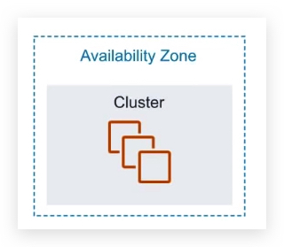

### Partition

- Spread instances across logical partitions
- Each partition do not share the underlying hardware with each other (rack per partition)
- Well suited for large distributed and replicated workloads (Hadoop, Cassandra, Kafka)

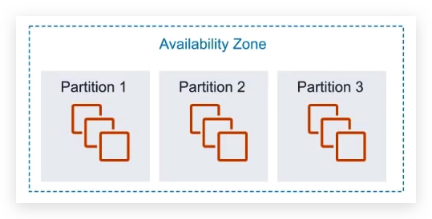

### Spread

- Each instance is placed on a different rack
- When critical instances should be keep separated from each other
- You can spread a max of 7 instances. Spread can be multi-AZ

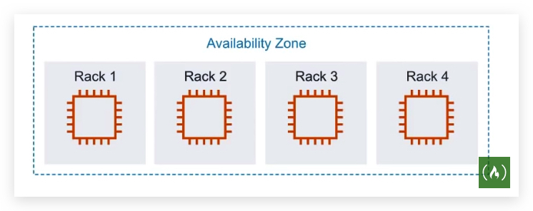

## EC2 - User Data

You can provide an EC2 with **User Data** which is a **script** that will be automatically run when launching an EC2 instance. You could install package, apply updates or anything you like.

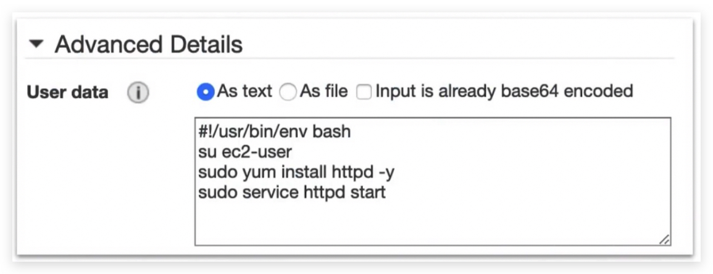

From within the EC2 instance, if you were to SSH in and CURL this special URL, you can see the **User Data** script.

```
curl http://169.254.169.254/latest/user-data
```

## EC2 - MetaData

From within your EC2 instance you can access information about the EC2 via a special url endpoint at `169.254.169.254`.

You would SSH into your EC2 instance and can use the CURL command:

```
curl http://169.254.169.254/latest/meta-data
```

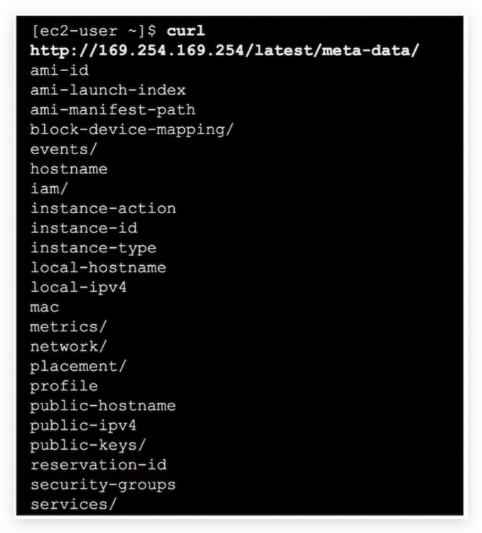

Combine **metadata** with **user data** scripts to perform all sorts of advanced AWS staging automation.

## EC2 - Pricing Model

### On-Demand

**_Least Commitment_**

- Low cost and flexible
- Only pay per hour
- Short-term, spiky, unpredictable workloads,
- For first time apps
- Cannot be interrupted

### Reserved Instances

**_Up to 75% off, Best Long-term_**

- Steady state or predictable usage
- Commit to EC2 over 1 year or 3 year
- Can resell unused reserved instances

### Spot

**_Up to 90% off, Biggest Savings_**

- Request space computing capacity
- Flexible start and end times
- Can handle interruptions (server randomly stopping and starting)
- For non-critical background jobs

### Dedicate

**_Most Expensive_**

- Dedicated servers
- Can be on-demand or reserved (up to 70% off)
- When you need a guarantee of isolate hardware (enterprise requirement)

## EC2 - On Demand Instances

**_Least Commitment_**

When you launch an EC2 instance, it's by default using **On-Demand** Pricing.

On-Demand has **no up-front payment** and **no long-term commitment**.

You're changed by the **hour** or by the **minute** (varies based on EC2 instance types).

On-Demand is for applications where the workload is for **short-term**, **spiky** or **unpredictable**. When you have a **new app** for development or you want to run experiment.

## EC2 - Reserved Instances (RI)

**_Best Long-term_**

Designed for applications that have a **steady-state**, **predictable usage**, or require **reserved capacity**.

Reduced Pricing is based on **Term** x **Class Offering** x **Payment Option**.

- **Terms**: You commit to a **1 Year** or **3 Year** contract. The longer the term the greater saving.
- **Class offering**
  - **Standard**: Up to **75%** reduced pricing compared to on-demand. Cannot change RI attribute.
  - **Convertible**: Up to **54%** reduced pricing compared to on-demand. Allows you to change RI attributes if greater or equal in value.
  - **Scheduled**: You reserve instances for specific time periods eg. once a week for a few hours. Saving vary.
- **Payment Options**: **All Upfront**, **Partial Upfront**, and **No Upfront**. The greater upfront the greater the savings.

**RIs** can be **shard between multiple accounts** within an org.

**Unused RIs** can be sold in the **Reserved Instance Marketplace**.

## EC2 - Spot Instances

**_Biggest Savings_**

AWS has **unused compute capacity** that they want to maximize the utility of their idle servers.

Spot Instances provide a discount of **90%** compared to On-Demand Pricing.

Spot Instances can be terminated if the computing capacity is needed by on-demand customers.

Termination Conditions:

- Instances can be terminated by AWS **at anytime**
- If your instance is **terminated by AWS**, **you don't get charged** for a partial hour of usage
- If **you terminate** an instance, **you will still be charged** for any hour that it ran

## EC2 - Dedicate

**_Most Expensive_**

Designed to meet regulatory requirements. When you have strict **server-bound licensing** that won't support multi-tenancy or cloud deployments.

Offer in both **On-Demand** and **Reserved** (70% off on-demand pricing)

**Enterprise** and **Large Organizations** may have security concerns or obligations about against sharing the same hardware with other AWS customers.

**Multi-Tenant**: When multiple customers are running workloads on the same hardware. **Virtual Isolation** is what separate customers.

**Single-Tenant**: When a single customer has delicates hardware. **Physical Isolation** is what separates customers.

## EC2 - Cheat Sheet

### Introduction Cheat Sheet

- **Elastic Computer Cloud (EC2)** is a Cloud Computing Service
- Configure your EC2 by choosing your **OS**, **Storage**, **Memory**, **Network Throughput**
- Launch and SSH into your server **within minutes**
- EC2 comes in variety Instance Types specialized for different roles:
  - **General Purpose**: balance of computer, memory and networking resource
  - **Computer Optimized**: ideal for computer bound applications that benefit from high performance processor
  - **Memory Optimized**: fast performance for workloads that process large data sets in memory
  - **Accelerated Optimized**: hardware accelerators, or co-processors
  - **Storage Optimized**: high, sequential read and write access to very large data sets on local storage
- Instance Sizes **generally double** in price and key attributes
- **Placement Groups** let you choose the logical placement of your instances to optimize for communications, performance or durability
- **Placement groups** are free
- **User Data** is a script that will be automatically run when launching an EC2 instance
- **Metadata** is about the current instance which you can access this metadata via a local endpoint when SSH into
- **Instance Profile** is a container for an IAM role that you can use to pass role information to an EC2 instance when the instance starts

### Pricing Models Cheat Sheet

- EC has 4 pricing models: **On-Demand**, **Spot**, **Reserved Instances(RI)**, and **Dedicated**
- **On-Demand Instances**: least commitment
  - Low cost and flexible
  - Only pay per hour
  - **Use case**: short-term, spiky, unpredictable workloads, first time apps
  - Ideal when your workloads cannot be interrupted
- **Reserved Instances**: up to 75% off, best long-term value
  - **Use case**: steady state or predictable usage
  - Can resell unused reserved instances via Reserved Instance Marketplace
  - Reduced priced is based on **Term** x **Class Offering** x **Payment Option**
  - **Payment Terms**: 1 year or 3 year
  - **Payment Options**: All Upfront, Partial Upfront, and No Upfront
  - **Class Offering**:
    - **Standard**: Up to 75% reduced pricing comparing to on-demand. Cannot change RI attributes
    - **Convertible**: Up to 54% reduced pricing compared to on-demand. Allows you to change RI attributes if greater or equal in value
    - **Scheduled**: You reserve instances for specific time period
- **Spot Instances**: up to 90% off, biggest savings
  - Request space computing capacity
  - Flexible start and end times
  - **Use case**: Can handle interruptions (server randomly stopping and starting)
  - **Use case**: For non-critical background jobs
  - Instance can be terminated by AWS **at anytime**
  - If your instance is **terminated by AWS**, **you don't get charged** for a partial hour of usage
  - If **you terminate** an instance, **you will still be charged** for any hour that it ran
- **Dedicated Instances**: most experience
  - Dedicated servers
  - Can be on-demand or reserved (up to 70% off)
  - **Use case**: When you need a guarantee of isolate hardware (enterprise requirement)

# Amazon Machine Image (AMI)

## AMI - Introduction

Amazon Machine Image (**AMI**) provides the information required to launch an instance.

You can **turn your EC2 instances into AMIs** so you can **create copies of your servers**.

AMIs are **Region Specific**.

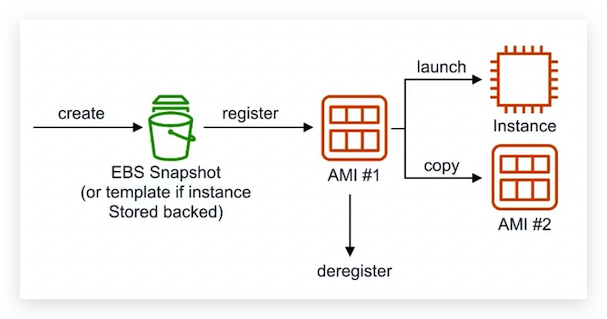

**An AMI holds the following information**:

- A template for the root volume for the instance (EBS Snapshot or Instance Store Template)
- Launch permissions that control which AWS accounts can use the AMI to launch instances
- A block device mapping that specifies the volumes to attach to the instance when it's launched

## AMI - Use Cases

1. AMIs help you keep incremental changes to your OS, application code and system packages.
2. Using **Systems Manager Automation**, you can routinely patch your AMIs with security updates and bake those AMIs.
3. AMIs are used with **LaunchConfigurations**. When you want to roll out updates to multiple instances, you make a copy of your LaunchConfigurations with new AMI.

## AMI - Marketplace

The AWS Marketplace lets you **purchase subscriptions** to vendor maintained AMIs.

## AMI - Creating an AMI

You can **create an AMI** from an existing EC2 instance that either running or stopped.

## AMI - Choosing an AMI

AWS has hundreds of AMIs you can **search** and select from.

**Community AMI** are free AMIs maintained by the **community**.

**AWS Marketplace** has free or paid AMIs maintained by **vendors**.

Amazon Machine Images can be selected based on:

- Region
- Operation System
- Architecture (32-bit or 64-bit)
- Launch Permissions
- Root Device Volume
  - Instance Store (Ephemeral Storage)
  - EBS Backed Volumes

## AMI - Copying an AMI

AMIs are **region specific**. If you want to use an AMI from another region. You need to **Copy the AMI** and then select the destination region.

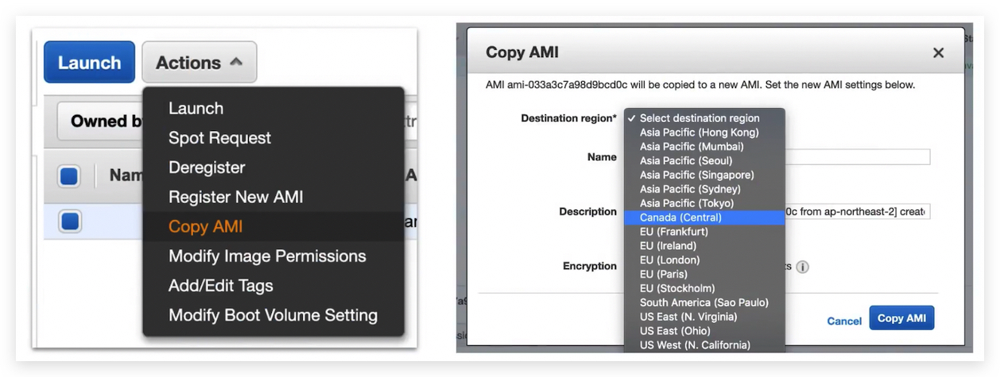

## AMI - Cheat Sheet

- **Amazon Machine Image (AMI)** provides the information required to launch an instance
- AMIs are region specific, if you need to use an AMI in another region you can copy an AMI into the destination region via **Copy AMI**
- You can **create an AMI** from an existing EC2 instance that's either **running** or **stopped**
- **Community AMI** are free AMIs maintained by the community
- **AWS Marketplace** has free or paid subscription AMIs maintained by vendors
- AMIs have an **AMI ID**. The same AMI (eg. Amazon Linux 2) will vary in both AMI ID and options (eg. Architecture options in different regions)
- **An AMI holds the following information**:
  - A template for the root volume for the instance (EBS Snapshot or Instance Store Template)
  - Launch permissions that control which AWS accounts can use the AMI to launch instances
  - A block device mapping that specifies the volumes to attach to the instance when it's launched
